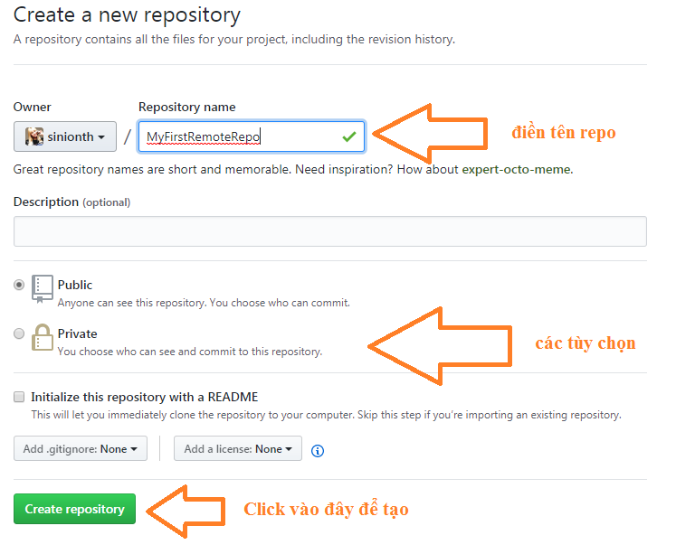
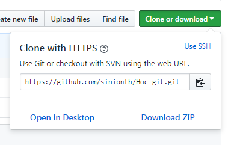
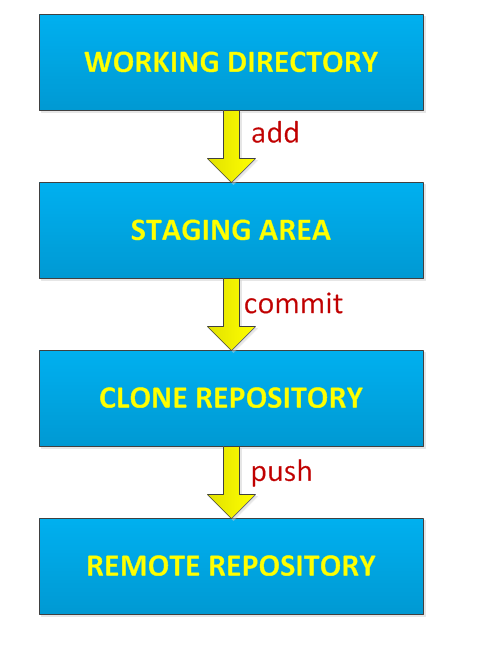
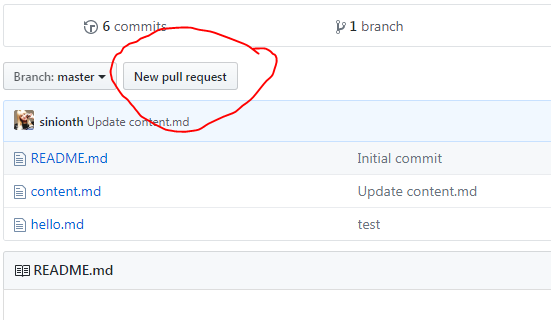

# 1.Giới thiệu sơ lược về Git
__Git__ là một hệ thống quản lý phiên bản phân tán.Nói một cách đơn giản là ta có một mã nguồn và muốn những người khác có thể cùng phát triển mã nguồn đó.Thì git sẽ giúp chúng ta có thể chia sẻ mã nguồn,thông qua git ta có thể kiểm soát những tác động của người khác tới mã nguồn đó và những tác động sẽ chỉ được thực hiện khi ta đồng ý.Một kho chứa mã nguồn trong git gọi là repository ,nó giống như một cái thư mục vậy.Trong đó có các file cấu hình cho git và mã nguồn.
# 2.Cài đặt git trên ubuntu
`apt-get install git -y`
# 3.Cấu hình thiết lập tên, Email
```
git config --global user.name "dung1101"
git config --global user.email "mrbeo1221119@gmail.com"
```
* thiết lập alias
```
git config --global alias.aa 'add *'
git config --global alias.aa 'commit -m'
git config --global alias.aa 'push origin master'
```
## Kiểm tra cấu hình
Sau khi cấu hình xong ta có thể xem lại cấu hình bằng cầu lệnh `cat ~/.gitconfig` hoặc `git --list`
# 4.Làm việc với Git
## 4.1.Thiết lập repository
Repository (kho chứa) là nơi lưu trữ mã nguồn và người khác có thể sao chép (clone/fetch/pull) lại mã nguồn để làm việc.
<br>Có 2 loại repo:
 -Local Repository 
 -Remote Repository
### Local Repository
Là repo lưu trữ tại máy cá nhân.Ta có thể tạo một local repo hoặc sao chép remote report.<br>
* Để tạo Local Repository sử dụng câu lệnh
```
cd [thư mục muốn lưu trữ repo]
git init [tên repo]

ví dụ
cd ~/mygit 
git init MyFirstRepo
```
Một thư mục có tên MyFirstRepo sẽ được tạo ra và trong đó có một thư mục .git chứa cấu hình cho repo.<br>
* Sao chép remote repo có hướng dẫn ở bên dưới
### Remote Repository
Là repo lưu trữ tại một server từ xa.Để tạo remote repo ta có thể sử dụng trang github.com.<br>
Sau khi đăng nhập tài khoản trên github
<br>

## 4.2.Thao tác cơ bản với git
### Chỉnh sửa remote repo của chính mình
Nếu repo chưa có tại máy cá nhân thì ta phải clone(tạo bản sao) từ remote repo trên github<br>

<br> câu lênh để clone `git clone [url]` ví dụ :`git clone https://github.com/sinionth/Hoc_git.git`
Sau khi clone về máy ta tiến hành chỉnh sửa repo<br>

<br>work folow khi ta tiến hành chỉnh sửa một repo
<br>working directory: thư mục chứa repo tại máy mà ta đã clone về để làm việc
<br>staging area: là khu vực lưu trữ những thay đổi trên tập tin so sánh giữa repo chính và repo clone trước commit
<br>clone repo: repo mà ta đã clone về từ remote repo
<br>remote repo: repo mà ta cần làm việc 
```
git add .
# thêm những thay đổi vào staging area
git commit -m "uptade repo"
# thêm những thay đổi vào clone repo
git push origin master
# đẩy lên trên remote repo
```
<br>Trước khi tiến hành ta phải sử dụng `git pull` để update những chỉnh sửa mới nhất của repo để tránh conflict
<br>Khi ta commit nhầm, git cho phép ta undo lại bằng cách
```
git reset HEAD~ --hard
  HEAD~ hoặc HEAD^ hoặc @^ : undo lại 1 commit để undo nhiều commit thì thêm số vào sau HEAD~5
  --hard: loại bỏ tất cả mọi thay đổi kể cả ở trong working directory 
  ngoài ra có lựa chọn khác là --soft thì sẽ dữ lại những thay đổi ở trong working directory
```
<br>Sau khi commit thành công nhưng ta lại muốn thay đổi mà không cần phải tạo commit mới thì ta có thể ghi đè commit mới nhât bằng option `--amend` trong commit
<br>Ta cũng có thể bỏ qua việc add vào staging area để commit thẳng bằng option `-a`
### Thực hiện chỉnh sửa remote repo của người khác
<br>Trước tiên ta phải `fork` repo sau đó mới `clone` về để làm việc<br>

<br>Các bước tiếp theo ta làm như trên 
<br>Do đây là repo của người khác nên sau khi push ta ta tạo một pull request mới để xin phép chủ sở hữu cho phép cập nhật chỉnh sửa<br>

### Chỉnh sửa remote repo
Kiếm tra remote<br>
`git remote -v`<br> 
<br>
Ta sẽ thấy origin.Đây là tên của remote repo tạo mặc định khi ta clone , ta hoàn toàn có thể đổi được
<br>`git remote rename [tên_cũ] [tên_mới]`
# 5.Sự khác nhau giữa clone, fetch và pull
3 lệnh để lấy dữ liệu về từ repository nhưng có sự khác nhau:<br>
* __git clone__:Sao chép toàn bộ dữ liệu trên repository và sao chép luôn các thiết lập về repository, tức là nó sẽ tự động tạo một master branch trên máy tính.Lệnh này chỉ nên sử dụng khi cần tạo mới Git repo trên máy tính với toàn bộ dữ liệu và thiết lập của một remote repository.<br>
* __git pull__:Tự động lấy toàn bộ dữ liệu từ remote repository và gộp vào cái branch hiện tại đang làm việc.<br>
* __git fetch__:Lấy toàn bộ dữ liệu từ remote repository nhưng sẽ cho phép gộp thủ công vào một branch nào đó trên thư mục Git ở máy tính.<br>
# 6.xem lịch sử commit
Sử dụng câu lệnh
`git log` để xem hoặc `git log -p` để xem thông tin chi tiết hơn
# 7.Branch - Làm việc với nhánh
## 7.1.Cơ bản về branch
Branch dùng để phân nhánh và ghi lại luồng làm việc trong git.Mục đích của branch đễ hỗ trợ làm việc song song.Khi khởi tạo repository hoặc clone một repository, sẽ có một nhánh (branch) chính tên là master (có thể hiểu master là thân cây). Đây là branch chứa toàn bộ các mã nguồn chính trong repository.<br>
Khi ta có 1 vấn đề cần đẩy lên repository mà không muốn làm ảnh hưởng tới branch `master` thì ta sẽ tạo 1 branch khác để thay thế.Từ đó các thay đổi trên branch master, branch mới sẽ diễn ra độc lập không ảnh hương tới nhau.
## 7.2.Thao tác với branch
## Tạo một branch
```
git branch branch_name 
  
git branch dung
```
## Liệt kê các branch
` git branch`
## Chuyển đổi giữa các branch
```
git checkout [branch_name]

git checkout dung
git checkout master
```
## Kiểm tra xem hiện tại đang ở nhánh nào
`cat ~/.git/HEAD` hoặc `git status`
## push dữ liệu lên remote repo
```
git push [tên repo] [tên nhánh]

git push origin dung
```
## xóa branch
```
git branch -d [branch_name]

git branch -d dung
```
